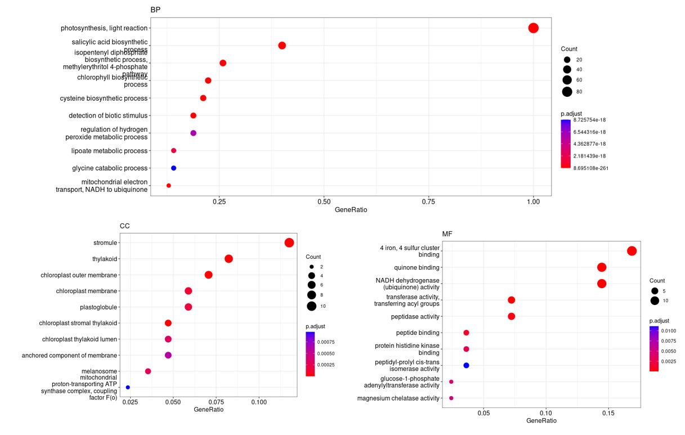
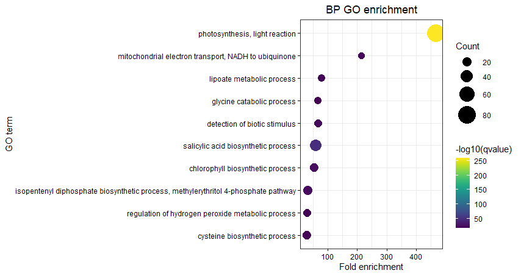

```{r, echo=FALSE}
knitr::opts_chunk$set(eval = FALSE)
```

# Objectives

In 2022, I needed to perform GO enrichment analyses on genes targeted by sRNAs in maize but at this time, I could not find any published annotation for B73 NAM5 assembly. Therefore, I have decided to use the Gene Ontology Meta Annotator for Plants ([GOMAP](https://bioinformapping.com/gomap/master/RUNNING.html)) pipeline to make my own GO annotation.

Just after that during the same year, MaizeGDB finally made available a GO term annotation for B73 NAM5 (available [here](https://download.maizegdb.org/GeneFunction_and_Expression/Pannzer_GO_Terms/)). This annotation was performed using [PANNZER](http://ekhidna2.biocenter.helsinki.fi/sanspanz/), see reference paper [Toronen & Holm, 2022](https://onlinelibrary.wiley.com/doi/full/10.1002/pro.4193).

Both PANNZER and GOMAP annotated 39,756 genes. However, GOMAP could generate 493,310 annotations vs 167,519 for PANNZER. I found results that made sense with GOMAP and decided to stick to this annotation. I would recommend people try both and compare the results, as I have found that using GO term annotations from different pipelines can yield quite different results (at least this was my experience in Arabidopsis). 

Although the GOMAP manual recommends running the pipeline on a high-performance cluster (HPC) due to high computational requirements, I ran the pipeline locally, and it took my workstation (10 quad-core processors of 2,2 GHz each) about one month to complete the annotation. Here I describe the GOMAP annotation pipeline I used and how I processed the output in R to perform GO enrichment analyses.

In addition, the group of Carolyn Lawrence-Dill at Iowa State University published the GOMAP annotation for all 26 NAM founders in [Fattel et al., 2024](https://bmcresnotes.biomedcentral.com/articles/10.1186/s13104-023-06668-6#Sec3). Their B73 NAM5 annotation contains 455,527 annotations, compared to 493,310 for me. This difference is likely due to the fact that they used only the longest transcript for each gene (ending up with 39,756 peptide sequences to analyze compared 72,539 for me). This step halved the number of sequences processed and therefore the computing time but 37,783 (493,310-455,527) annotations were lost. I would therefore recommend to compare both annotations and decide for yourself. The gaf file for their annotation can be downloaded [here](https://datacommons.cyverse.org/browse/iplant/home/shared/commons_repo/curated/Carolyn_Lawrence_Dill_GOMAP_Maize_MaizeGDB_B73_NAM_5.0_October_2022_v2.r1/1_GOMAP-output). I also provide a ready-to-go R object in this repository so no need to download it.

One additional value of this repository is that it provides a detailed protocol on how to perform GO term enrichment analysis using GOMAP output and the R package clusterProfiler.


# Software

* UNIX-based computer with a decent amount of RAM and cores (mine had 10 quad-core processors (40 cores) of 2.2 GHz each, 63 Gb of RAM, 4 Gb GPU, OS Linux Mint 19.1 Cinnamon)
* Singularity (version 3.6.3 used here)
* GOMAP (version 1.3.9 used here)
* clusterProfiler R package and dependencies

# Install Singularity and Go

I found this step to be the most tedious somehow. I had to use several come-arounds to install the softwares on my workstation. I recommend you first try the installation method from [syslabs](https://docs.sylabs.io/guides/3.0/user-guide/installation.html) and see if you need to go through the hard way (below) or not. I put the script I used here but you may try an easier way and you will have to adjust some variables.

```{bash}
sudo apt-get update && \
sudo apt-get install -y build-essential \
libseccomp-dev pkg-config squashfs-tools cryptsetup

sudo rm -r /usr/local/go

export VERSION=1.13.15 OS=linux ARCH=amd64  # change this as you need

wget -O /tmp/go${VERSION}.${OS}-${ARCH}.tar.gz https://dl.google.com/go/go${VERSION}.${OS}-${ARCH}.tar.gz && \
sudo tar -C /usr/local -xzf /tmp/go${VERSION}.${OS}-${ARCH}.tar.gz

echo 'export GOPATH=${HOME}/go' >> ~/.bashrc && \
echo 'export PATH=/usr/local/go/bin:${PATH}:${GOPATH}/bin' >> ~/.bashrc && \
source ~/.bashrc

curl -sfL https://install.goreleaser.com/github.com/golangci/golangci-lint.sh |
sh -s -- -b $(go env GOPATH)/bin v1.21.0

mkdir -p ${GOPATH}/src/github.com/sylabs && \
cd ${GOPATH}/src/github.com/sylabs && \
git clone https://github.com/sylabs/singularity.git && \
cd singularity

git checkout v3.6.3

cd ${GOPATH}/src/github.com/sylabs/singularity && \
./mconfig && \
cd ./builddir && \
make && \
sudo make install

singularity version
```

# Install GOMAP

Once Singularity and Go are installed properly, GOMAP should be easy to install. I used GOMAP v1.3.9 at the time but feel free to try with the most recent version at the time you run the pipeline.

```{bash}
# Clone GOMAP git repository
git clone https://github.com/Dill-PICL/GOMAP-singularity.git
cd GOMAP-singularity
git checkout v1.3.9

# Add this to your ~/.bashrc or run the line in the terminal
export GOMAP_LOC="/path/to/GOMAP-singularity/"

# Check if GOMAP runs
./test.sh
```


# Prepare protein sequences of B73 NAM5

Download the fasta file containing all annotated peptides from Maize GDB.

```{bash}
# Download fasta file and uncompress
wget https://download.maizegdb.org/Zm-B73-REFERENCE-NAM-5.0/Zm-B73-REFERENCE-NAM-5.0_Zm00001eb.1.protein.fa.gz
gunzip Zm-B73-REFERENCE-NAM-5.0_Zm00001eb.1.protein.fa.gz

# Check number of entries
grep ">" Zm-B73-REFERENCE-NAM-5.0_Zm00001eb.1.protein.fa | wc -l
72539

# Remove all asterisks ending sequences (would create a bug in GOMAP)
sed -i 's/\*//' Zm-B73-REFERENCE-NAM-5.0_Zm00001eb.1.protein.fa
```

# Create a GOMAP configuration file

GOMAP requires a configuration file called `min-config.yml` to run. I downloaded a template from the gomap developers and tweaked it a bit.
```{bash}
# Get config file for that job
wget --no-check-certificate https://bioinformapping.com/gomap/master/_static/min-config.yml \
min-config.yml.1
```

I changed the variables to get this:

```{bash}
input:
  #input fasta file name
  fasta: Zm-B73-REFERENCE-NAM-5.0_Zm00001eb.1.protein.fa
  # output file basename
  basename: maize_B73_NAM5
  #input NCBI taxonomy id
  taxon: "4577"
  # Name of the species
  species: "Zea mays"
  # Email is mandatory
  email: your_email@gmail.com
  #Number of CPUs used for tools
  cpus: 10
  #Whether mpi should be used (mpich-3.2.1  is default)
  mpi: False
  #what the name of the 
  tmpdir: "/tmp"
```

Note some important things: 
* Location of the fasta file, which should be in the same directory as the min-config.yml
* basename, this will be the prefix (maize_B73_NAM5) of the output gaf (GO annotation file format) file, here `maize_B73_NAM5.aggregate.gaf`
* Your email, needed to run one of the tools (Argot GO)
* cpus (=cores), depends on your workstation, the more, the faster your job will be. Plan anyway a good month to let your machine run if you don't have access to an HPC

# Run GOMAP pipeline

GOMAP runs four independent steps:

1. seqsim
2. domain
3. fanngo
4. mixmeth-blast

Run the 4 first steps in parallel, each using 10 cores (40 cores in total available on my workstation)

After 1-4 steps are finished, the last three steps need to be run consecutively
5. mixmeth-preproc
6. mixmeth
7. aggregate

Here are the commands:

```{bash}
cd /path/to/GOMAP-singularity/
# Be sure to have Zm-B73-REFERENCE-NAM-5.0_Zm00001eb.1.protein.fa
# and min-config.yml in this directory

./run-GOMAP-SINGLE.sh --step=seqsim --config=min-config.yml

./run-GOMAP-SINGLE.sh --step=domain --config=min-config.yml

./run-GOMAP-SINGLE.sh --step=fanngo --config=min-config.yml

./run-GOMAP-SINGLE.sh --step=mixmeth-blast --config=min-config.yml

./run-GOMAP-SINGLE.sh --step=mixmeth-preproc --config=min-config.yml

./run-GOMAP-SINGLE.sh --step=mixmeth --config=min-config.yml

./run-GOMAP-SINGLE.sh --step=aggregate --config=min-config.yml
```

# Post-processing of the output file

The output file will look like this:

```{bash}
head maize_B73_NAM5.aggregate.gaf
!gaf-version:2.0
!db     db_object_id    db_object_symbol        qualifier       term_accession  db_reference    evidence_code   with    aspect  db_object_name  db_object_synonym       db_object_type  taxon   date    assigned_by     annotation_extensiongene_product_form_id
GOMAP   Zm00001eb000010_P001    Zm00001eb000010_P001            GO:0003690      GOMAP:0000      IEA     SMART:SM00733   F                       gene    taxon:4577      20221204        GOMAP-v1.3.9
GOMAP   Zm00001eb000010_P001    Zm00001eb000010_P001            GO:0003727      GOMAP:0000      IEA     RBH:I1IST9      F                       gene    taxon:4577      20221129        GOMAP-v1.3.9
```

Note that each protein isoforms are annotated but people usually consider only genes when performing GO term enrichment analyses. Therefore, one must collapse this annotation at the gene level:

```{bash}
# Get protein isoform and GO term
# Remove 2 first lines (headers)
sed '1,2d' maize_B73_NAM5.aggregate.gaf | cut -f2 - | \
                cut -d_ -f1 - > maize_B73_NAM5.aggregate.gaf.genes
sed '1,2d' maize_B73_NAM5.aggregate.gaf | \
                cut -f5 - > maize_B73_NAM5.aggregate.gaf.go

paste maize_B73_NAM5.aggregate.gaf.go maize_B73_NAM5.aggregate.gaf.genes | \
                sort | uniq > maize_B73_NAM5.aggregate.GO_gene.gaf

# Compare number of lines once protein isoforms are merged
wc -l maize_B73_NAM5.aggregate.gaf
846030 maize_B73_NAM5.aggregate.gaf

wc -l maize_B73_NAM5.aggregate.GO_gene.gaf
493310 maize_B73_NAM5.aggregate.GO_gene.gaf
```

Note the difference, with 846,030 annotations when considering protein isoforms, and 493,310 when collapsed at the gene level. If different protein isoforms of the same gene have different GO terms, the information is kept at the gene level anyway. Also, these output files being too big to upload in GitHub (maize_B73_NAM5.aggregate.gaf = 100 Mb, maize_B73_NAM5.aggregate.GO_gene.gaf=92.6Mb), I provided a more compact R object containing a dataframe with the geneID and their corresponding GO IDs (TERM2GENE.rds, 1.48 Mb, see below). I can provide the raw text files upon request if needed.

# Perform GO term enrichment analysis

Now, one can use this gaf file in different softwares performing GO term enrichment analysis. I am personally using [clusterProfiler](https://bioconductor.org/packages/release/bioc/html/clusterProfiler.html). Here the two publications:

* [Yu et al 2012](https://www.liebertpub.com/doi/10.1089/omi.2011.0118)
* [Wu et al 2021](https://www.sciencedirect.com/science/article/pii/S2666675821000667?via%3Dihub)

These two resources give nice examples of how to use clusterProfiler: [https://yulab-smu.top/biomedical-knowledge-mining-book/index.html](https://yulab-smu.top/biomedical-knowledge-mining-book/enrichment-overview.html) and [https://guangchuangyu.github.io/2016/01/go-analysis-using-clusterprofiler/]([https://guangchuangyu.github.io/2016/01/go-analysis-using-clusterprofiler/).

I detailed below how to run a GO term analysis using B73 NAM5 gene ID (e.g. Zm00001eb000800).

## Install clusterProfiler

Get all these libraries clusterProfiler needs:

```{r}
# Install Bioconductor packages
if (!require("BiocManager", quietly = TRUE)) install.packages("BiocManager") 
bioconductor_packages <- c("DOSE","clusterProfiler","enrichplot","AnnotationDbi","GO.db")
BiocManager::install(bioconductor_packages)

# Install CRAN packages
cran_packages <- c("tidyverse","readxl","xlsx")
for (count in 1:length(cran_packages)) install.packages(cran_packages[count])

# Cross fingers and hope everything was installed properly
library(clusterProfiler)
library(DOSE)
library(enrichplot)
library(xlsx)
library(readxl)
library(AnnotationDbi)
library(GO.db)
library(tidyverse)

```

## Create TERM2NAME and TERM2GENE R objects

clusterProfiler needs 3 things to work:
* TERM2NAME data frame, which contains two columns: GO term ID (GO:0009880) and GO description "embryonic pattern specification"
* A TERM2GENE data frame, which contains two columns: GO term ID (GO:0000001) and B73 NAM5 gene ID "Zm00001eb000800"
* vector containing the B73 NAM5 gene IDs to be processed into the clusterProfiler function "enrich"

I have already added the TERM2NAME and TERM2GENE R objects in this GitHub repository, so you only need to generate TERM2GENE file if you work with a different gaf file than the one generated in this GOMAP pipeline for B73 NAM5 annotation.

### Create TERM2NAME object

Get a summary of all 44,509 GO ID and their terms (http://geneontology.org/docs/GO-term-elements). These are available in the GOTERM object of the AnnotationDbi package.

> Every term has a human-readable term name e.g. mitochondrion, glucose transmembrane transport, or amino acid binding and a GO ID, a unique seven digit identifier prefixed by GO:, e.g. GO:0005739, GO:1904659, or GO:0016597

This step must be performed only once and the TERM2NAME R object is the same for any GO annotation file of any species.

```{r}
library(AnnotationDbi)

# Put GOTermsAnnDbBimap object into a dataframe
df_GOTERM <- as.data.frame(GOTERM)

# Remove first column (otherwise, two redundant column)
df_GOTERM <- df_GOTERM[,2:7]

# Create a list of dataframe with terms classified by ontology types
TERM2NAME_BP <- df_GOTERM %>% dplyr::filter(Ontology == "BP") %>%
    dplyr::select(go_id,Term) %>% unique()
TERM2NAME_CC <- df_GOTERM %>% dplyr::filter(Ontology == "CC") %>%
    dplyr::select(go_id,Term) %>% unique()
TERM2NAME_MF <- df_GOTERM %>% dplyr::filter(Ontology == "MF") %>%
    dplyr::select(go_id,Term) %>% unique()

# Create a list of dataframe
TERM2NAME <- list(BP=TERM2NAME_BP, CC=TERM2NAME_CC, MF=TERM2NAME_MF)

# Save this R object
saveRDS(TERM2NAME, "TERM2NAME.rds")

```

### Create TERM2GENE object

We now want to import the modified output gaf file generated by GOMAP to extract the geneID and GO terms.

```{r}
# Import data in R
TERM2GENE <- read.delim("maize_B73_NAM5.aggregate.GO_gene.gaf", header=F)
colnames(TERM2GENE) <- c("GO","gene")

saveRDS(TERM2GENE, "TERM2GENE.rds")
```

Do the same for the published annotation from [Fattel et al 2024](https://doi.org/10.1186/s13104-023-06668-6) and create a second `TERM2GENE.rds` object called `TERM2GENE_Fattel_2024.rds`. To use this file, to quote (#) 
`TERM2GENE <- readRDS("TERM2GENE_Fattel_2024.rds")` and unquote 
`TERM2GENE <- readRDS("TERM2GENE_Fattel_2024.rds")` in .


Download `1.1_GOMAP-output.gaf` from [here](https://datacommons.cyverse.org/browse/iplant/home/shared/commons_repo/curated/Carolyn_Lawrence_Dill_GOMAP_Maize_MaizeGDB_B73_NAM_5.0_October_2022_v2.r1/1_GOMAP-output).

```{bash}
sed '1,2d' 1.1_GOMAP-output.gaf | cut -f2 - | \
                cut -d_ -f1 - > 1.1_GOMAP-output.gaf.genes
sed '1,2d' 1.1_GOMAP-output.gaf | \
                cut -f5 - > 1.1_GOMAP-output.gaf.go

paste 1.1_GOMAP-output.gaf.go 1.1_GOMAP-output.gaf.genes | \
                sort | uniq > 1.1_GOMAP-output.aggregate.GO_gene.gaf
```


```{r}
# Import data in R
TERM2GENE <- read.delim("1.1_GOMAP-output.aggregate.GO_gene.gaf", header=F)
colnames(TERM2GENE) <- c("GO","gene")

saveRDS(TERM2GENE, "TERM2GENE_Fattel_2024.rds")
```

That's it!

Now we have everything set to perform our first GO term analysis.

# Run GO term enrichment analysis

I created a [go_functions.R](go_functions.R) file that can be sourced in your current R or Rmarkdown file to call the functions needed to run the analysis. This file contains two R functions:

The function `ego_analysis` performs three GO term analyses, one for each ontology: Biological process (BP), cellular component (CC), and molecular function (MF). One can explicit the wanted ontology when using the function `enrichGO` using the argument "ont" (e.g. `ont="MF"`) but this is not possible when using home-made GO annotation (as we do here for B73 NAM5). In the case of home-made annotation, clusterProfiler provides the function `enrich` but there is no possibility to define what ontology to investigate. I, therefore, split the TERM2NAME object into three separate objects, containing BP, CC, and MF GO terms. The home-made function `ego_analysis` will return a list of ego result objects (class enrichResult) that can be processed further for plotting with for instance the `dotplot` function of the `enrichplot` package (we will see that below). One can also easily turn these "enrichResult" class R objects into classical data frames to perform easy manipulation with `tidyverse` functions.

The function `go_search` is a practical tool to find correspondences between gene ID, GO ID, and a GO term name. Little examples are worth lengthy explanations:

```{bash}
# Get me all GO ID matching the maize gene Zm00001eb000690
head(go_search(method="gene2GO", "Zm00001eb000690"))
       go_id                                                          Term
1 GO:0000976 transcription regulatory region sequence-specific DNA binding
2 GO:0003700                     DNA-binding transcription factor activity
3 GO:0005634                                                       nucleus
4 GO:0006351                                  transcription, DNA-templated
5 GO:0006355                    regulation of transcription, DNA-templated
6 GO:0008289                                                 lipid binding

# Get me all maize genes being annotated with the GO ID GO:0003700
head(go_search(method="GO2gene","GO:0003700"))
          GO            gene
1 GO:0003700 Zm00001eb000210
2 GO:0003700 Zm00001eb000470
3 GO:0003700 Zm00001eb000690
4 GO:0003700 Zm00001eb001210
5 GO:0003700 Zm00001eb001460
6 GO:0003700 Zm00001eb001550

# Get the GO ID for the term description "nucleus"
go_search(method="term2GO", "nucleus")
       go_id    Term
1 GO:0005634 nucleus

# Get me the term description for GO ID "GO:0000006"
go_search(method="GO2term", "GO:0000006")
       go_id                                                  Term
1 GO:0000006 high-affinity zinc transmembrane transporter activity

# Get me the ontology for GO ID "GO:0000006"
go_search(method="GO2ontology", "GO:0000006")
MF
```

Now, let's run our first analysis.

```{r}
# Clone this repository
git clone https://github.com/johanzi/GOMAP_maize_B73_NAM5.git
cd GOMAP_maize_B73_NAM5

# Source go_functions.R
source("go_functions.R")
# Note the chdir=TRUE is needed if you load go_functions.R
# from outside of the GOMAP_maize_B73_NAM5 directory (otherwise, R will fail
# to load the two R objects
source("path/to/go_functions.R", chdir=TRUE)

# Let's make a vector of all 85 genes annotated with
# GO ID GO:0019684 (photosynthesis, light reaction)
geneID_GO0019684 <- TERM2GENE %>% filter(GO=="GO:0019684") %>% 
 dplyr::select(gene) %>% pull()

# Run the ego_analysis function providing the vector of geneID argument
list_ego_results <- ego_analysis(geneID_GO0019684)

# Check if any of the three analyses yielded GO terms
# with significant p-adjusted value.
lapply(list_ego_results, function(x) sum(x@result$p.adjust < 0.05))

$ego_BP
[1] 112

$ego_CC
[1] 19

$ego_MF
[1] 14

# We get significant hits in all three ontologies
```
If any significant enrichment is found, one can visualize the results using the `dotplot` function from the `enrichplot` package. If you want to tweak the plotting parameters, have a look at the enrichplot vignette [here](https://bioconductor.org/packages/release/bioc/manuals/enrichplot/man/enrichplot.pdf). However, I would recommend to directly use ggplot2 (see section "Customized GO term plots").

```{r}
dotplot(list_ego_results$ego_BP,showCategory=10, title="BP")
dotplot(list_ego_results$ego_CC,showCategory=10, title="CC")
dotplot(list_ego_results$ego_MF,showCategory=10, title="MF")
```

Here, the 10 most significant terms are displayed and sorted by decreasing GeneRatio (from to bottom). The adjusted p-value is color-coded, and the number of genes for each GO term is defined by the diameter of the circles.




Here, the term "GO:0019684 (photosynthesis, light reaction)" is the strongest signal since we selected all 85 genes annotated with this term, so the GeneRatio is 1 (85/85).

By default, `dotplot` displays the GeneRatio but one can also choose to display the BgRatio, richFactor, or FoldEnrich by using the x argument. E.g. `dotplot(list_ego_results$ego_BP, x="FoldEnrich", showCategory=10, title="BP")`.

Here a definition of these variables:

* GeneRatio (gene ratio): Number of input genes compared to all input genes analyzed (k/n)
* BgRatio (background ratio): Number of genes in a given GO term compared to all annotated genes (M/N)
* richFactor (enrichment factor): Number of input genes compared to total number of genes annotated for a given GO term (k/M)
* FoldEnrich (fold enrichment): Enrichment of the term in your input gene list as compared to the background population of genes for a given GO term (GeneRatio/BgRatio)


Abbreviations:

- k = Number of my genes of interest found for a given GO term
- n = All genes used as input in the GO term enrichment analysis
- M = Total number of genes annotated within a given GO term
- N = Total number of genes annotated for a given genome (e.g. 39,756 genes for maize here)

Note that richFactor and FoldEnrich are proportional so the only difference on the plot would be the values of the x-axis.

To dig further into the GO enrichment analysis of the three ontologies, one can turn it into one data frame containing the results for all three ontologies using the home-made function `enrichResult2dataframe` (found in `go_functions.R`):

```{r}
# Turn list of enrichResult objects into one dataframe
df_ego_analysis <- enrichResult2dataframe(list_ego_results)

# Keep only significant hits (here I use alpha risk 5%)
df_ego_analysis_significant <- df_ego_analysis %>% dplyr::filter(p.adjust < 0.05)

```

The ontology term (BP, CC, or MF) will be added as the first column. One can then export this data frame as a text file to import in Excel (ribbon Data > import from text) and filter by the header row. This is a convenient option to add the output in Supplementary tables, coming along with GO term plots shown in figures. I find this is a good practice and allows readers to quickly explore the results in Excel.

```{r}
write_delim(df_ego_analysis_significant, "df_ego_analysis_significant.txt", delim="\t")
```

One can also retrieve the genes from the data frame for a given GO term. This command will generate a vector that can be exported as text file for further processing:

```{r}
gene_GO0009695 <- df_ego_analysis_significant %>% filter(ID=="GO:0009695") %>% 
        dplyr::select(geneID) %>% str_split("/") %>% unlist()

# Export as text file
data.table::fwrite(list(gene_GO0009695), "gene_GO0009695.txt")
```


# Customized GO term plots

You can also directly use directly ggplot2 instead of the wrapper function `enrichplot::dotplot` to plot your GO enrichments.

I use the package [viridis](https://cran.r-project.org/web/packages/viridis/vignettes/intro-to-viridis.html) to provide colorblind-friendly color-coding.

Here, I choose to display only the top 10 most significant term for the BP ontology and order the top 10 by increasing fold enrichment values.

```{r}
library("viridis")

df_ego_analysis_significant %>% arrange(qvalue) %>% filter(ontology=="BP") %>%
  head(10) %>%
  mutate(Description = fct_reorder(Description, FoldEnrich)) %>%
  ggplot(aes(x=FoldEnrich, y=Description, color=-log10(qvalue))) +
  geom_point(aes(size = Count))  + xlab("Fold enrichment") + 
  ylab("GO term") + 
  ggtitle("BP GO enrichment") +
  theme_bw() +
  theme(axis.text.x = element_text(color="black"),
        axis.text.y = element_text(color="black"),
        axis.ticks = element_line(color = "black")) +
  theme(plot.title = element_text(hjust = 0.5)) +
  scale_size_area(max_size = 10) +
  scale_color_viridis()

```




# Process clusterProfiler output in Revigo

It is sometimes difficult to interpret GO term enrichment analysis plot because of the redundancy between terms. The webtool [Revigo](http://revigo.irb.hr/) provides different ways to visualize the GO enrichment results. See details in [Supek et al., 2011](https://journals.plos.org/plosone/article?id=10.1371/journal.pone.0021800). The online tool requires two things: a GO term and its associated adjusted p-value.

You can easily retrieved this from the dataframe `df_ego_analysis_significant` you created above:

```{r}
# Select only GO term ID and adjusted pvalue
df_ego_analysis_significant_revigo <- df_ego_analysis_significant %>%
  dplyr::select(ID, p.adjust)

# Export the new dataframe into a text file
write_delim(df_ego_analysis_significant_revigo, 
  "df_ego_analysis_significant_revigo.txt", delim="\t", col_names = F)
```

Then just copy-paste the content of `df_ego_analysis_significant_revigo.txt` in [Revigo](http://revigo.irb.hr/) and choose the species (here Zea mays (4577)). 

Here it is, the end of the pipeline. I hope this will save time for others who struggle finding a GO term annotation and a straightforward way to visualize GO term enrichment analysis results.


# Author

* **Johan Zicola** - [johanzi](https://github.com/johanzi)

# License

This project is licensed under the MIT License - see the [LICENSE](LICENSE) file for details